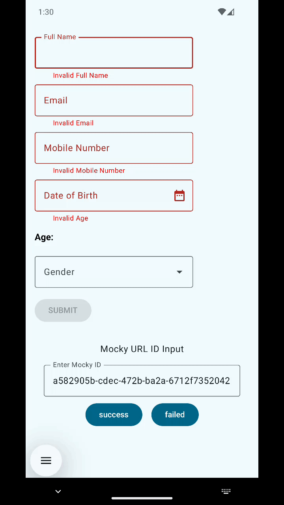

This project is an Android application built using Jetpack Compose and Ktor, featuring a form that collects user details such as full name, email, mobile number, date of birth (with automatic age calculation), and gender. The form includes validation for proper formatting and age restrictions. Upon submission, the data is sent to a test API endpoint created using Mocky.io, and the response is displayed in a dialog.

# Demo


# Sample Data
https://run.mocky.io/v3/a582905b-cdec-472b-ba2a-6712f7352042
```json
{
  "status": "success",
  "message": "Form submitted successfully"
}
```

https://run.mocky.io/v3/1a774192-ec97-49f4-9d05-68b3315d74e7
```json
{
  "status": "failed",
  "message": "Invalid input detected. Please check your details and resubmit."
}
```
